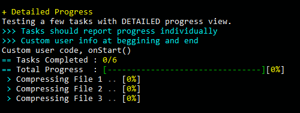
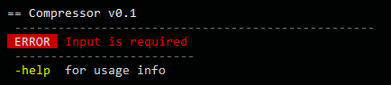
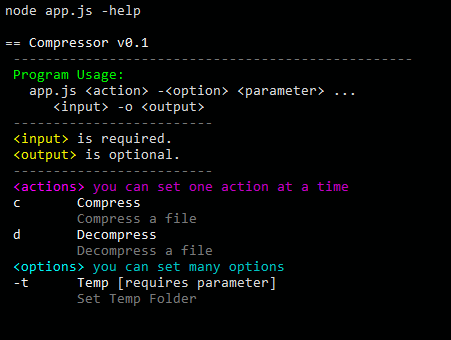

# `djNode` (haxe library)

**Version:** 0.5  
**Author:** John Dimi :computer:, <johndimi@outlook (.) com> *twitter*: [@jondmt](https://twitter.com/jondmt)  
**Project Page and Sources:** [https://github.com/johndimi/djNode](https://github.com/johndimi/djNode)  **Language:** Haxe 4.0  
**Requires:** hxnodejs , **Compiles to:** nodeJS code  
**Platform:** Windows & Linux

**djNode** is a set of tools and helpers for creating **nodeJS CLI** applications fast and easily.

### :loudspeaker: Features
- Terminal **Print Helper** class, that supports coloring, text formatting, cursor manipulation and more.
- Advanced **input arguments handling** with automatic safeguards and easy retrieval of argument options/actions.
- Automatic handling of multiple **Tasks** that can run in **sync** or **async**. Progress reports and chaining.
- Easy external **CLI application spawner** with built in helpers to read stdout/stderr
- Simple **LOG system** that can output to a file or http using sockets (**in development**)
- Some useful **String** and **File** related helper functions
- More to come


### :small_blue_diamond: How to install

`haxelib git djNode https://github.com/johndimi/djNode.git`


### :electric_plug: Components/Tools

Included in the source is a **test** project that showcases and tests the various components. 

#### `Terminal.hx`
Contains basic functions for printing and moving the cursor.  
:star2: **Feature** : Inline tagging system to quickly inject color codes, used in `sprintf` and `printf` functions.

*Example 1:*    

```javascript
T.printf('~yellow~Quick and easy~green~ Multicolored~red~ Strings~!~\n');
```
  

*Screen from the Terminal Demo:*  


#### `CTask.hx`
An object that holds user code. It reports progress and status updates to a manager object `CJob`. Tasks can run in **sync** or **async**. The manager is responsible for queuing and executing tasks.  
SYNC tasks can only run by themselves. ASYNC tasks can only run with other Async tasks or on their own. Depending on the task queue.

> Create `CTasks` and add them to a `CJob` manager

#### `CJob.hx`
An object handling `CTask` objects. It will report status and progress with callbacks on complete, fail, progress updated.  
**example**

```haxe
var j = new CJob("Job Name");

	j.add(new CTask(function(t){
		// This code will run when this task is called
		// you can do async or sync stuff in here, just call:
	   	   t.complete();
		// when you are done
	},"QuickTask");

	// You can create your own custom Tasks by extending the CTask Class:
	j.add(new CTaskExtract('file1.zip'));

	// These tasks will run concurrently :
	j.addAsync(new CTaskDownload("fileLocation..."));
	j.addAsync(new CTaskDownload("fileLocation..."));
	j.addAsync(new CTaskDownload("fileLocation..."));

	// The number of MAX concurrent tasks can be set with
	j.MAX_CONCURRENT = 2; 

	// Start the job
	j.start(); 
```

*Screen from the Job Demo, shows tasks running in sequence:*


#### `CJobReport.hx`
Listens to a `CJob` status updates and write progress to the terminal.  
**Features** : Can also show individual track progress, (*Check the test project*)

*Synoptic Job report*  


*Individual Task Report*  



### `BaseApp.hx`
It's the what main entry class of the program should extend.  
You can declare what kind of actions, options, inputs and outputs the program expects and will read and parse those arguments based on the rules you set. Also it will create usage info based on all the rules and expected actions.options.

*e.g.* You can require your program to expect an input file, or expect an option with a parameter, etc. The program will  produce informative error messages when a rule is not satisfied

- Inputs : *required, optional, multiple, no*
- Output : *yes, no, optional*
- Actions : *Only one action can be set at a time*
- Options: *Multiple options can be set at a time, some options require arguments*

**example**, Making the program to expect an input file and a program action.
```haxe
class Main extends BaseApp {
	override function init():Void{
		PROGRAM_INFO = {
			name : "Compressor",
			version : "0.1"
		}
		ARGS.inputRule = "yes";
		ARGS.outputRule = "opt";
		ARGS.requireAction = true;
		ARGS.Actions.push(['c', 'Compress', 'Compress a file']);
		ARGS.Actions.push(['d', 'Decompress', 'Decompress a file']);
		ARGS.Options.push(['t', 'Temp', 'Set Temp Folder','yes']);
		super.init();
	}
```

**Automatic Error Message if arguments are missing**\


**You can access the passed in arguments like this:**

```haxe
	override function onStart() 
	{
		argsInput[];    // Array containing all inputs
		argsAction;    // String containing <action> code .e.g. 'a'
		argsOptions.t; // Temp Folder parameter
	}
```

**Use `-help` to print automatic usage infos:**  


### :notebook: Notes

This is mostly personal library that I have used in some projects and tools, like:  
- cdcrush *(cd game compression)* https://www.npmjs.com/package/cdcrush

- romdj *(emulation Rom Builder)* https://github.com/johndimi/romdj

- djTui *(NodeJS TUI interface library)* https://github.com/johndimi/djTui

- psxlauncher *(TUI based emulator launcher)* https://github.com/johndimi/psxlauncher

  

:warning: **WARNING** In case the Windows Default Command Line doesn't work use another console emulator like [cmder](http://cmder.net/) (*recommended*)

