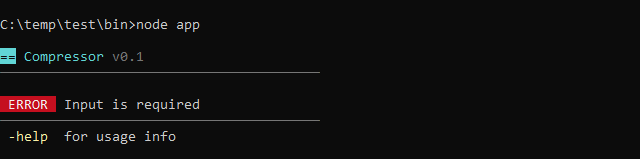
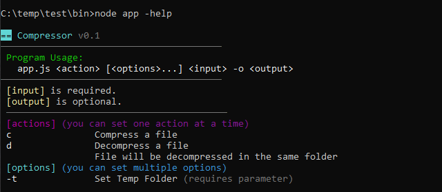
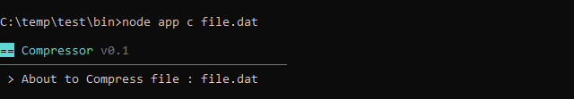
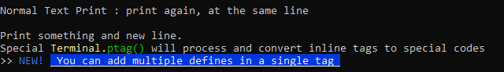
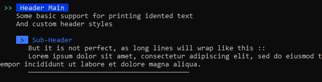
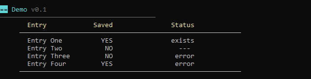
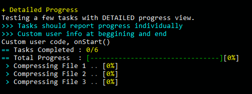

# djNode

**Version:** 0.6 *(2020_10),* **Author:** John Dimi, **License:** MIT  
**djNode** is a set of tools and helpers for **HAXE**; for creating **nodeJS CLI** applications.

##  Features  :loudspeaker:

- Terminal **Print Helper** class, that supports coloring, text formatting, cursor manipulation and more.
- Advanced **input arguments handling** with automatic safeguards and easy retrieval of argument options/actions.
- Automatic handling of multiple **Tasks** that can run in **sync** or **async**. Progress reports and chaining.
- Easy external **CLI application spawner** with built in helpers to read stdout/stderr
- Simple **LOG system** that can output to a file in real time
- Some useful **File** related helper functions
- Easy **keyboard** interaction, get keystrokes at realtime or a string at a time


### Automatic input parameter definition and handling

```haxe
// Defining Input Rules and Accepted Actions/Options
ARGS.inputRule = "yes";
ARGS.outputRule = "opt";	// Optional 
ARGS.requireAction = true;
ARGS.Actions = [
    ['c', 'Compress a file'],
    ['d', 'Decompress a file\nFile will be decompressed in the same folder'],
];
ARGS.Options = [
    ['t', 'Set Temp Folder', '1']
];
```
- Running the application with no parameters:
  
- Running with `-help` argument:
  
- Running with a valid action and input file:
  

- Handling passed`action` is automatic and easy

```haxe
switch (argsAction)
{
    case 'c': // Defined earlier in ARGS.Actions
        T.print(" > About to Compress file : " + argsInput[0]).endl();
    case 'd': // Defined earlier in ARGS.Actions
        T.print(" > About to Decompress file : " + argsInput[0]).endl();
}
// Note `argsInput` is an Array that holds ALL Input parameters [0] to get the first one
// If no input parameters were set, the program will error, since it requires at least 1
```


### Printing Helpers

- The standard `Terminal` object, offers some basic terminal printing and cursor manipulation

  ```haxe
  // T is an instantiated Terminal.hx class and is a public static var in `BaseApp`
  T.print('Normal Text Print : ');
  T.print('print again, at the same line');
  T.endl().endl();
  T.println('Print something and new line.');
  T.ptag("Special <yellow>Terminal.<!><green>ptag()<!> will process and convert inline tags to special codes\n");
  T.ptag(">> <blue>NEW!<!> <bold,underl,:darkblue,white> You can add multiple defines in a single tag <!>\n");
  ```
  


- :new: `PRINT2.hx` offers even more helpers for printing Text and creating Tables.

  ```haxe
  var P = new djNode.utils.Print2();
  P.H("Header Main", 0);
  P.p("Some basic support for printing idented text");
  P.p("And custom header styles").br();	// You can chain
  P.H("Sub-Header", 1);
  P.p("But it is not perfect, as long lines will wrap like this ::");
  P.p("Lorem ipsum dolor sit amet, consectetur adipiscing elit, sed do eiusmod tempor incididunt ut labore et dolore magna aliqua.");
  P.line();
  // Printing a header will fix the left margin so all next Print2, print calls will respect the margin set
  ```

    

- `Print2` offers some table functions

  ```haxe
  // Start printing everything in Print2 at 5 characters from the left of the terminal
  P.lpad = 5;
  // Declare a table (3 columns)
  // Column 1 : L,16,2 == Left align,  20 width , 2 pad from left
  // Column 2 : R,6   == Right align, 12 width , no pad from left
  // Column 3 : C,30,3 == Right align, 30 width , 3 from left
  P.table('L,16,2|R,6|C,30,3');
  // Setup some colors for the table header
  P.T.bold().fg(yellow);
  // Add a whole row of data
  P.tr(["Entry", "Saved", "Status"]);
  P.T.reset();
  P.tline();	
  P.tr(["Entry One", "YES", "exists"]);
  P.tr(["Entry Two", "NO", "---"]);
  P.tr(["Entry Three", "NO", "error"]);
  P.tr(["Entry Four", "YES", "error"]);
  P.tline();	
  ```

    

### Job/Task System

- djNode offers a simple task system. Where you can create a bunch of tasks, and have a job process them in parallel or sequentially. Checkout [cdcrush](https://github.com/johndimi/cdcrush) for a better usage example

  ```haxe
  // Creating a JOB with Test Tasks
  var j = new CJob("Testing multiple concurrent progress");
      j.MAX_CONCURRENT = 3;
  	j.onComplete = ()->{trace("Job Complete!");};
  	// These 5 tasks will run in parallel
      j.addAsync(new CTestTask(1200,'Compressing File 1'));
      j.addAsync(new CTestTask(2200,'Compressing File 2'));
      j.addAsync(new CTestTask(2800,'Compressing File 3'));
      j.addAsync(new CTestTask(2500,'Compressing File 4'));
      j.addAsync(new CTestTask(1700,'Compressing File 5'));
      // When all the previous tasks complete. This next one will start
      j.add(new CTestTask(800, 'Finalizing'));
      // This is a special object, will take a JOB and write progress to the terminal
      var report = new CJobReport(j, true);
  ```

    


### Notes :notebook: 

This is mostly personal library that I have used in some projects and tools, like: 
- cdcrush *(cd game compression)* https://github.com/johndimi/cdcrush
- romdj *(emulation Rom Builder)* https://github.com/johndimi/romdj
- djTui *(NodeJS TUI interface library)* https://github.com/johndimi/djTui
- psxlauncher *(TUI based emulator launcher)* https://github.com/johndimi/psxlauncher

:warning: **WARNING** In case the Windows Default Command Line doesn't work use another console emulator like [cmder](http://cmder.net/) (*recommended*)

---

<sup> thanks for checking this out</sup>