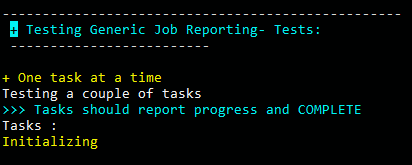

# djNode library for HAXE

**Version:** 0.2rc\
**Author:** John Dimi, <johndimi@outlook.com>, twitter:[@jondmt](https://twitter.com/jondmt)\
**Language:** Haxe 3.x\
**Requires:** hxnodejs\
**Compiles to:** nodeJs code\
**Platform:** Windows & Linux

__djNode__ is a set of tools and helpers for creating **nodeJS CLI** applications fast and easily. 

----------

## Features

- Terminal Wrapper that supports coloring, text formatting, cursor manipulation and more.
- Advanced input arguments handling with automatic safeguards and easy retrieval of argument options/actions.
- Automatic handling of multiple Tasks that can run in **sync** or **async**. Progress reports and chaining.
- Easy external CLI application spawner with build in helpers to read stdout/stderr
- Simple LOG system that can output to a file or http using sockets (**in development**)
- More to come

### How to install

`haxelib git djNode https://github.com/johndimi/djNode.git`\
or\
`haxelib git djNode https://github.com/johndimi/djNode.git dev`\
to get the DEV branch

### Components/Tools

Included in the source is a **test** project that showcases and tests the various components. 

#### `CTask.hx`
An object that holds user code. It reports progress and status updates to a manager object `CJob`. Tasks can run in **sync** or **async**. The manager is responsible for queuing and executing tasks.\
SYNC tasks can only run by themselves. ASYNC tasks can only run with other Async tasks or on their own. Depending on the task queue.

#### `CJob.hx`
An object handling `CTask` objects. It will report status and progress with callbacks on complete, fail, progress updated.

#### `CJobReport.hx`
Will listen to a `CJob` status updates and write progress to the terminal.

#### `Terminal.hx`
- Colors
- Moving the cursor
- Supports **custom TAGS** in strings to quickly set colors and styles inline
- Chaining commands
- Check the source and tests for more

e.g.
`Terminal.printf("~yellow~This text is yellow~green~ And this is green")`\
is the same as writing:\
`Terminal.fg("yellow").print("This text is yellow").fg('green').print(" And this is green")`

### `BaseApp.hx`
It's the class that the main entry class of the program should extend.\
You can declare what kind of actions, options, inputs and outputs the program expects and will read and parse the arguments based on the rules you set.
e.g. You can require your program to expect an input file, or expect an option with a parameter, etc. The program will  produce informative error messages when a rule is not satisfied\
Also it will create usage info based on all the rules and expected actions.options.

- Input : required, optional, multiple, no
- Output : yes, no, optional
- Actions : Only one action can be set at a time
- Options: Multiple options can be set at a time, some options require arguments

### Infos

Mostly personal library that I use in some tools of mine. Also CDCRUSH nodejs version uses this.

>WARNING

There is a **breaking bug in nodejs** in **windows**.  `Terminal.hx` will not manipulate the cursor correctly in windows default command line.
**How to solve:**
- use **nodejs v4.x**
- use another console emulator like [cmder](http://cmder.net/) (*recommended*)
